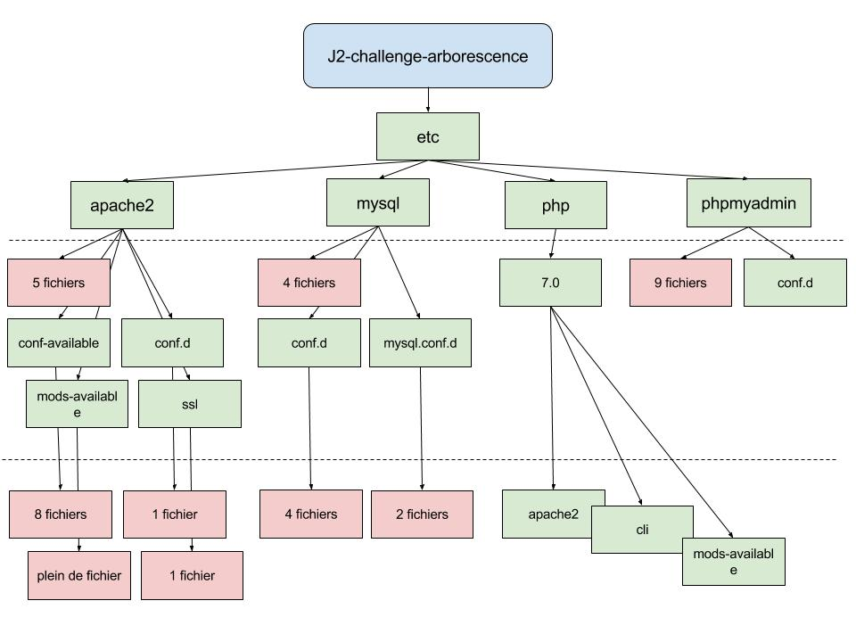

# Challenge n°2b
Intitulé : **Arborescence**  

Guillaume DURAND  
Promo : Explorer  
S1-J2 | 03/10/2017

Formateur : Dario  
Type : Arborescence

## Objectif
Uniquement à l'aide du terminal, explorer et cartographier l'arborescence du dossier du challenge.

## Résultat

